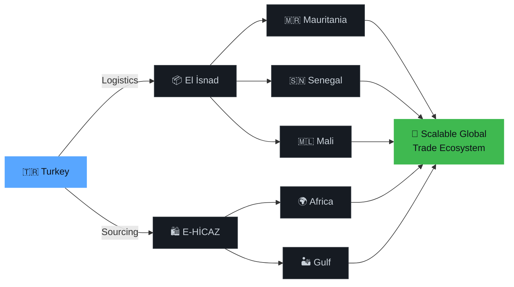

<!-- ╔══════════════════════════════════════════════════════════════════╗ -->
<!-- ║                    KHALED MOHAMED BALLA                        ║ -->
<!-- ║           International Finance & Global Trade                  ║ -->
<!-- ╚══════════════════════════════════════════════════════════════════╝ -->

<div align="center">

<!-- Custom Animated SVG Header — Upload header.svg to your repo -->
<a href="https://github.com/khaledkhyoucbe-stack">
  
</a>

<br/>

<!-- Dynamic Typing -->
<a href="https://git.io/typing-svg">
  
</a>

<br/>

<!-- Minimal Badge Row -->
<a href="https://github.com/khaledkhyoucbe-stack?tab=followers"></a>

<a href="https://github.com/khaledkhyoucbe-stack?tab=stars"></a>

</div>

<br/>

<!-- ━━━━━━━━━━━━━━━━━━━━━━━━━━━━━━━━━━━━━━━━━━━━━━━━━━━━━━━━━━━━━━━ -->

##  &nbsp;Who Am I


I'm an **International Finance professional** and **entrepreneur** operating at the intersection of trade, logistics, and financial systems — with a laser focus on building scalable business models across **Turkey**, **Africa**, and **Gulf markets**.

```yaml
📍 Based in:       Mauritania 🇲🇷 ⟷ Turkey 🇹🇷
🎓 Education:      PhD Candidate — International Finance
🏢 Ventures:       El isnad Logistics · HİCAZ Trading
🔬 Research:       Trade Finance · Islamic Finance · Emerging Markets
🎯 Mission:        Build a scalable global trade ecosystem
💬 Languages:      Arabic · French · English · Turkish
```

<br clear="both"/>

<!-- ━━━━━━━━━━━━━━━━━━━━━━━━━━━━━━━━━━━━━━━━━━━━━━━━━━━━━━━━━━━━━━━ -->

## 🧭 &nbsp;Strategic Focus

<table align="center">
  <tr>
    <td align="center" width="25%">
      <br/>
      <strong>Trade Finance</strong><br/>
      <sub>Export Credit · LCs<br/>Payment Solutions</sub>
    </td>
    <td align="center" width="25%">
      <br/>
      <strong>Islamic Finance</strong><br/>
      <sub>Participation Banking<br/>Sukuk · Shariah Compliance</sub>
    </td>
    <td align="center" width="25%">
      <br/>
      <strong>Global Trade</strong><br/>
      <sub>Africa–Turkey Corridors<br/>Gulf Expansion</sub>
    </td>
    <td align="center" width="25%">
      <br/>
      <strong>Financial Analysis</strong><br/>
      <sub>Econometrics<br/>Risk Modeling</sub>
    </td>
  </tr>
</table>

<!-- ━━━━━━━━━━━━━━━━━━━━━━━━━━━━━━━━━━━━━━━━━━━━━━━━━━━━━━━━━━━━━━━ -->

## ⚡ &nbsp;Tech & Tools

<div align="center">

#### 💻 &nbsp;Development

&nbsp;
&nbsp;
&nbsp;
&nbsp;
&nbsp;
&nbsp;

#### 📊 &nbsp;Analytics & Research

&nbsp;
&nbsp;
&nbsp;
&nbsp;
&nbsp;

#### 🛠 &nbsp;Business & Platforms

&nbsp;
&nbsp;
&nbsp;
&nbsp;
&nbsp;

</div>

<!-- ━━━━━━━━━━━━━━━━━━━━━━━━━━━━━━━━━━━━━━━━━━━━━━━━━━━━━━━━━━━━━━━ -->

## 📈 &nbsp;GitHub Analytics

<div align="center">
  
  &nbsp;
  
</div>

<br/>

<div align="center">
  
</div>

<br/>

<div align="center">
  
</div>

<br/>

<div align="center">
  
</div>

<!-- ━━━━━━━━━━━━━━━━━━━━━━━━━━━━━━━━━━━━━━━━━━━━━━━━━━━━━━━━━━━━━━━ -->

## 🚀 &nbsp;Ventures & Projects

<div align="center">
<table>
<tr>
  <td width="50%">
    <h3 align="center">🏢 El isnad Logistics</h3>
    <p align="center">
      
    </p>
    <p align="center">
      Full-spectrum export operations between Turkey and West Africa.
      <br/>Freight forwarding, customs clearance, and supply chain optimization.
    </p>
    <p align="center">
      
      
      
    </p>
  </td>
  <td width="50%">
    <h3 align="center">🛍️ HİCAZ Trading</h3>
    <p align="center">
      
    </p>
    <p align="center">
      Cross-border sourcing and e-commerce platform.
      <br/>Connecting Turkish manufacturers with African & Gulf buyers.
    </p>
    <p align="center">
      
      
      
    </p>
  </td>
</tr>
<tr>
  <td colspan="2">
    <h3 align="center">💻 SaaS Trade Finance Platform</h3>
    <p align="center">
      
    </p>
    <p align="center">
      Smart financial analytics dashboard for trade operations · LC management · Export documentation automation · Real-time currency & risk monitoring
    </p>
  </td>
</tr>
</table>
</div>

<!-- ━━━━━━━━━━━━━━━━━━━━━━━━━━━━━━━━━━━━━━━━━━━━━━━━━━━━━━━━━━━━━━━ -->

## 💼 &nbsp;Services

<div align="center">

| &nbsp; | Service | What You Get |
|:---:|:---|:---|
| 🌍 | **Export Consulting** | Market entry strategies for Turkey → Africa & Gulf corridors |
| 📦 | **Supply Chain Solutions** | End-to-end freight, customs clearance & warehouse management |
| 🛒 | **E-commerce Launch** | Shopify store setup, dropshipping systems & product sourcing |
| 💰 | **Trade Finance Advisory** | Letters of credit, export credit & international payment flows |
| 🤝 | **Business Matchmaking** | Direct connections between manufacturers and global buyers |
| 📊 | **Financial Research** | Econometric modeling, feasibility studies & market analysis |

</div>

<div align="center">
  <br/>
  <a href="mailto:ballakh727@gmail.com">
    
  </a>
</div>

<!-- ━━━━━━━━━━━━━━━━━━━━━━━━━━━━━━━━━━━━━━━━━━━━━━━━━━━━━━━━━━━━━━━ -->

## 📚 &nbsp;Research Interests

<div align="center">

```
┌─────────────────────────────────────────────────────────────────┐
│                                                                 │
│   📄  Sovereign Wealth Funds & Geopolitical Risk Assessment     │
│   📄  Islamic Finance Systems in Emerging Economies             │
│   📄  Trade Finance Mechanisms in Africa–Turkey Corridors       │
│   📄  Participation Banking: Models & Growth Trajectories       │
│   📄  Export Credit Systems & Financial Inclusion               │
│   📄  Digital Trade Platforms & FinTech in Developing Markets   │
│                                                                 │
└─────────────────────────────────────────────────────────────────┘
```

</div>

<!-- ━━━━━━━━━━━━━━━━━━━━━━━━━━━━━━━━━━━━━━━━━━━━━━━━━━━━━━━━━━━━━━━ -->

## 🌍 &nbsp;Global Vision

<div align="center">



</div>

<!-- ━━━━━━━━━━━━━━━━━━━━━━━━━━━━━━━━━━━━━━━━━━━━━━━━━━━━━━━━━━━━━━━ -->

## 🐍 &nbsp;Contribution Snake

<div align="center">
  <picture>
    <source media="(prefers-color-scheme: dark)" srcset="https://raw.githubusercontent.com/khaledkhyoucbe-stack/khaledkhyoucbe-stack/output/github-snake-dark.svg" />
    <source media="(prefers-color-scheme: light)" srcset="https://raw.githubusercontent.com/khaledkhyoucbe-stack/khaledkhyoucbe-stack/output/github-snake.svg" />
    
  </picture>
</div>

<!-- ━━━━━━━━━━━━━━━━━━━━━━━━━━━━━━━━━━━━━━━━━━━━━━━━━━━━━━━━━━━━━━━ -->

## 🤝 &nbsp;Connect With Me

<div align="center">

<a href="mailto:ballakh727@gmail.com"></a>&nbsp;
<a href="https://web.facebook.com/khaled.balla.3"></a>&nbsp;
<a href="https://www.youtube.com/@el-amirii"></a>&nbsp;
<a href="https://github.com/khaledkhyoucbe-stack"></a>

</div>

<!-- ━━━━━━━━━━━━━━━━━━━━━━━━━━━━━━━━━━━━━━━━━━━━━━━━━━━━━━━━━━━━━━━ -->

<br/>

<div align="center">
  
</div>

<div align="center">
  <sub>
    <em>"Building efficient trade systems is not just logistics — it is the infrastructure of global economic power."</em>
  </sub>
  <br/><br/>
  
</div>
